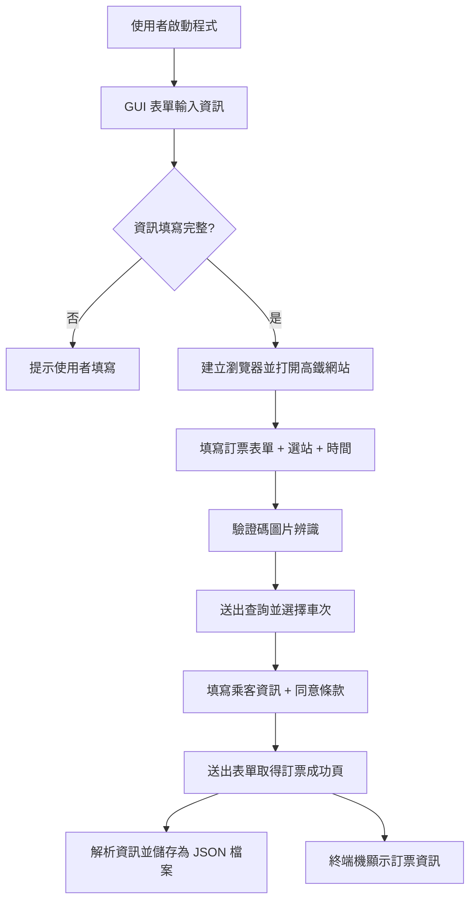

# 🚄 THSRBot 高鐵快手：自動訂票機器人

一套使用 Python 與 Selenium 開發的 **高鐵快手：自動訂票機器人**，配合圖形化介面，使用者只需輸入資料，即可自動完成整個訂票流程，從選擇班次、辨識驗證碼、填寫旅客資料，到最終的訂單資訊下載。

---

## ✨ 功能特色

- 🖥️ 圖形化操作介面（Tkinter + ttkbootstrap）
- 🔍 自動填寫起訖站、日期、時間與張數
- 🤖 自動處理驗證碼辨識（使用 `ddddocr`）
- 📩 自動輸入身分證與電子信箱資料
- 💾 成功訂票後自動儲存 JSON 訂單紀錄
- 🧠 發生錯誤時自動重試（最多三次）

---

## 📦 安裝與執行方式

### 系統需求

- Python 3.8 ~ 3.12
- Google Chrome
- ChromeDriver（版本需與 Chrome 對應）

### 安裝套件

```bash
pip install selenium ddddocr ttkbootstrap | pip install -r requirements.txt

```

### 啟動程式

```bash
python main.py
```

---

## 🧾 GUI 輸入欄位說明

| 欄位名稱     | 說明與格式              | 必填 |
|------------|----------------------|------|
| 出發日期     | 格式：YYYY/MM/DD     | ✅   |
| 出發時間     | 格式：HH:MM          | ✅   |
| 出發站       | 從下拉選單中選擇         | ✅   |
| 抵達站       | 從下拉選單中選擇         | ✅   |
| 張數         | 整數（成人票數）         | ✅   |
| 身分證字號    | 台灣身份證格式，大寫     | ✅   |
| 電子郵件     | 例如：abc@gmail.com  | ❌   |

---

## 🗂️ 專案結構

```
THSRBot/
├── main.py                     # 主程式入口，負責錯誤重試與 log 記錄
├── requirements.txt		    # 需安裝套件
│
├── THSR_bot/
│   ├── booking.py              # 訂票核心流程，包含表單填寫、自動點擊
│   ├── browser.py              # 瀏覽器啟動與反自動化設定 Selenium WebDriver
│   ├── gui.py                  # GUI 表單介面（Tkinter + ttkbootstrap）
│   ├── ocr.py                  # 使用 ddddocr 進行驗證碼辨識
│   └── parser.py               # 提取並解析最終訂單資訊
├── orderfolder/                # 儲存成功的訂單 JSON 檔案
└── errorfolder/                # 儲存錯誤資訊與堆疊紀錄
```

---

## 📊 訂票流程圖



---

## 🔮 未來功能規劃

* [ ] 加入 `DateEntry` 選擇器取代手動輸入日期
* [ ] 加入 `TimePicker` 時間下拉選單
* [ ] 支援選擇不同票種（如：兒童票、敬老票等）
* [ ] 多乘客訂票支援與身份驗證
* [ ] UI/UX 優化 + 多語系介面

---

## ⚠️ 注意事項

* 本專案僅供學術與學習用途，請勿濫用以免影響網站正常運作。
* 台灣高鐵網站結構若變更，需同步調整程式碼中的選擇器與流程。

---

## 👨‍💻 作者資訊

作者：Bheadwei
版本：v1.0.0
授權：MIT License

---

